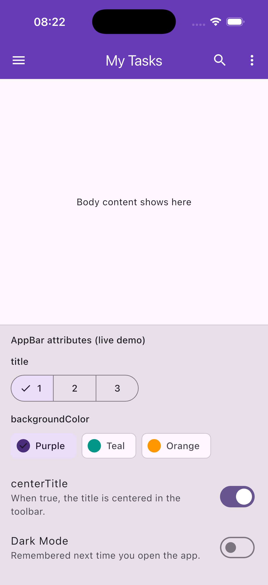

# AppBar widget demo

A small task-list app that shows how `AppBar` gives a screen its top navigation bar (title, menu, and actions).

## Run

```bash
flutter pub get
flutter run
```

Use a phone emulator, desktop window, or Chrome. The bottom panel changes three `AppBar` properties while the bar updates live.

## Three attributes

| Property | What it changes on screen |
|----------|---------------------------|
| `title` | Text shown in the toolbar (e.g. "My Tasks" vs "Team Sprint"). |
| `backgroundColor` | Fill color behind the title and icons. |
| `centerTitle` | Whether the title sits in the horizontal center of the bar (`true`) or follows the platform default alignment (`false`). |

Relevant code is in `lib/appbar_widget_demo.dart` inside the `AppBar(...)` constructor.

## In-class presentation date

Presented: June 15, 2026.

## Screenshot



Capture after running the app:

```bash
mkdir -p docs
flutter run -d deviceId
```

## Dark mode

A switch in the attribute panel toggles between light and dark themes. The choice is saved with `shared_preferences` so the app reopens in the same mode you left it in.

## Sources

Layout pattern inspired by the Flutter [Material AppBar](https://api.flutter.dev/flutter/material/AppBar-class.html) docs. Task list UI is original to this repo.

Dark mode persistence implemented following [Read and write data in Flutter using SharedPreferences](https://www.geeksforgeeks.org/flutter/read-and-write-data-in-flutter-using-sharedpreferences/) (GeeksforGeeks).
